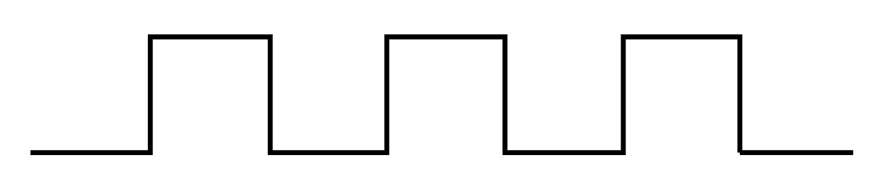

+++
date = '2025-03-05T12:46:04-08:00'
draft = false 
title = 'Making a Capacitance Meter'
tags = ['Cooper Keely', 'Project', 'Capacitance Meter', 'Embedded Systems', 'Arduino', 'Metrology']
+++
## Introduction
This project started off in a microprocessor design class, I was taking Fall of 2024. 
The final project was to design and create a capacitance meter. 
The specifications that we needed to meet were along these lines.
- Measure within 1% accuracy 
- Custom Designed PCB
- Accurate mesurments between pico farads to hundreds of micro farads
- Does not need an external computer to operate
- Uses to leads to perform measurements
- Implements auto ranging functionality
- A measurement must be made within 5ms

## Theory Of Operation
To be able to measure across a wide range of values while keeping high accuracy.
We needed to develop our own method of measurement.

We used two techniques to cover the low and high capacitance values a 555 Astable Multivibrator and a RC charging circuit.

### 555 Astable Multivibrator
If your not an EE or a CE the name of this method probably sounds a bit intimidating.
So let me break it down.

A [555 timer](https://en.wikipedia.org/wiki/555_timer_IC) is an integrated circuit that can be used to produce, time delays, oscilators, and PWM signals. 
Astable means the signal produced by the 555 doesn't need any external trigger to switch states.
Multivibrator means the signel produced by the 555 timer switches between a high and low state.

In sum all a 555 Astable Multivibrator means is that the timer produces a square wave.

In the 555 timer [data sheet](https://www.ti.com/lit/ds/symlink/lmc555.pdf?ts=1741137223203&ref_url=https%253A%252F%252Fwww.google.com%252F) it gives a layout that produces a square wave.
It also adds the corresponding equation to calcualte the frequency of oscilation.

|Layout | Equation  |
|:------|----:|
||\begin{aligned} f &= \frac{1}{1.4R_cC} \end {aligned}|

We can re-arrange this equation to get the following.
\begin {aligned}
C &= \frac{1}{1.4R_cf}
\end {aligned}
So, if we know the Resistor value and can accuratly measure the frequency we can then calculate capacitance.

### RC Charging Circuit
\begin{aligned}
I &= \frac{V_b}{R} e^{\frac{-t}{RC}}
\end{aligned}

